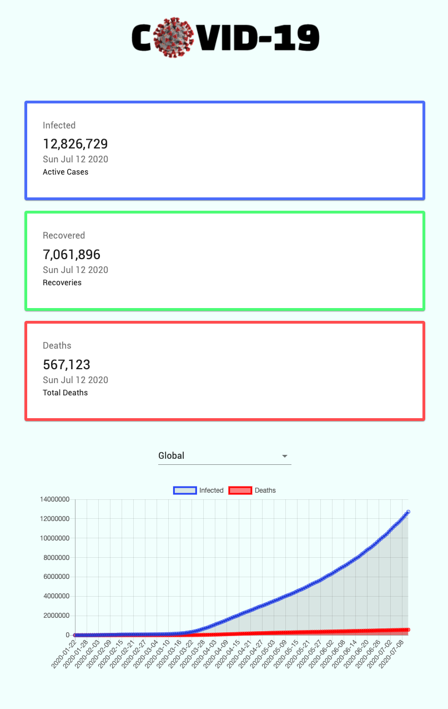

## COVID19 Tracker

## Description

COVID-19 is a React front end that fetches latest coronavirus statistics from an external API and displays the number of cases under three distinct categories. Users may also chose to display statistics for a specific country.

### Features

-  Upon first opening the site, current coronavirus statistics are displayed.
-  User can hover over the line chart and see exact numbers for a given date.
-  User may select a country from the dropdown to view the statistics for that country in a bar chart format

## Live page

https://covid-tracker-rouge.vercel.app/

## Built using

-  React
-  Chart.js
-  Axios
-  Countup
-  CSS Modules

## API used:

https://github.com/mathdroid/covid-19-api

## Screenshot

